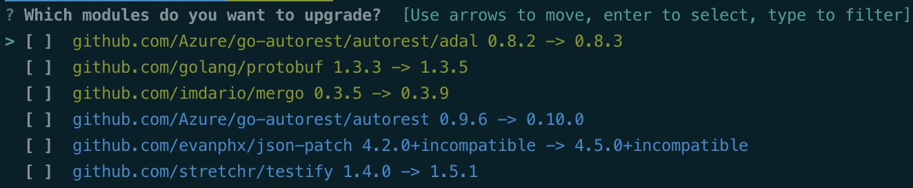

# gomo

[](https://travis-ci.com/frasercobb/gomo)
[](/license)
[](https://github.com/frasercobb/gomo/releases/latest)

Interactive CLI to upgrade go module dependencies.



Currently a work in progress.

## Installation

Binaries for OS X and Linux are available on the [releases page](https://github.com/frasercobb/gomo/releases).

Alternatively, you can install using go:

```
go install github.com/frasercobb/gomo
```

## Usage

```
gomo
```

Output will be coloured by update type:
* Green indicates a patch update
* Blue indicates a minor update